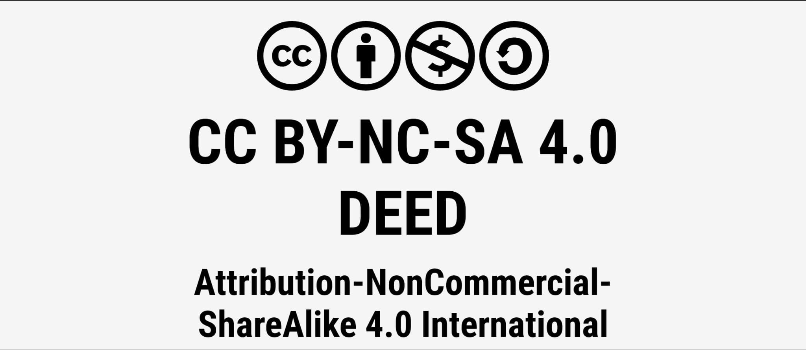

# Victor Garcia Cantalapidera 
-Slack:[@Victor Garcia](https://code-institute-room.slack.com/team/U0695HZA7FZ)

-GitHub: [Vgarcan](https://github.com/Vgarcan)

-LinkedIn: [Victor Garcia](https://www.linkedin.com/in/vgc89/)

## Check us out!

[LimonXemo - GitHub Pages](https://vgarcan.github.io/CodeInstitute-proj02/) 


## Table of Contents

- [Introduction](#introduction)
- [Features](#features)
- [Technologies Used](#technologies-used)
- [Project Structure](#project-structure)
  - [CSS Management for Project Structure](#css-management-for-project-structure)
- [Wireframes](#wireframes)
- [Colors](#colors)
  - [Color Customization Process](#color-customization-process)
  - [User-Friendly Approach](#user-friendly-approach)
- [User Experience](#user-experience)
  - [Key Principles](#key-principles)
  - [User Stories](#user-stories)
  - [Customization and Flexibility](#customization-and-flexibility)
  - [Future Enhancements](#future-enhancements)
- [Testing](#testing)
   - [HTML Validation](#html-validation)
   - [CSS Validation](#css-validation)
   - [Accessibility](#accessibility)
   - [Wave Validation](#wave-validation)
   - [Lighthouse Validation](#lighthouse-validation)
   - [Device testing](#device-testing)
   - [Browser Compatibility](#browser-compatibility)
   - [User Stories Testing](#user-stories-testing)
- [Collaborative Efforts](#collaborative-efforts)
- [Current State and Future Plans](#current-state-and-future-plans)
    - [Current State](#current-state)
    - [Future Plans](#future-plans)
- [Deployment](#deployment)
- [License](#license)
- [Bugs and Challenges](#bugs-and-challenges)
- [Acknowledgement](#acknowledgement)

## Introduction

Xemusic is a personal project initiated by the need to address the musical showcasing requirements of a friend. This endeavor sparked an exploration into the realm of Audio Software Development, leading to the inception of the Xemusic project. Within this project, Limonxemo stands as the flagship application, serving as a testament to the research and development efforts in this field.

Driven by the desire to delve into audio software development, Xemusic aims to provide a platform for experimentation and learning. Limonxemo, the primary outcome of this endeavor, represents a starting point in this journey. It is a versatile music player application designed not only for music playback but also for podcast streaming, showcasing its adaptability and multifunctionality.


With Limonxemo, users can enjoy seamless audio playback experiences, whether they are listening to their favorite tracks or engaging with compelling podcast content. The project aspires to transcend beyond traditional music players by offering support for various audio formats and catering to the diverse needs of creators and listeners alike.

## Features
### Dynamic Background Change

One unique feature of this project is the dynamic background that changes according to the time of day. Using JavaScript's built-in `Date` object, the application fetches the current time from the user's browser and adjusts the background accordingly:

- **Morning:** A background with a sun and clouds.
- **Night:** A background with a moon and clouds.

The logic is as follows:
- If the current time is between 7 PM and 5 AM, the background switches to night mode.
- Otherwise, it remains in day mode.

This feature enhances the user experience by providing a visually pleasing and context-aware interface.

Here's an example of the implementation:

```javascript
// TIME FETCHING
const time = (new Date()).getHours();
if (time >= 19 || time <= 5) document.body.style.backgroundImage = "url('/CodeInstitute-proj02/assets/imgs/bg-night-min.webp')";
else document.body.style.backgroundImage = "url('/CodeInstitute-proj02/assets/imgs/skybg-min.webp')";

```

### Music Playback

The core feature of the project is seamless music playback. Users can select and play tracks from the music library without interruptions. This includes:

- **Play/Pause:** Easily play or pause the current track.
- **Skip Forward/Backward:** Move to the next or previous track with a simple click.
- **Seek:** Use the slider to jump to different parts of the track.

### Playlists Management

Users can manage their music library effectively with features like:

- **Add/Remove Tracks:** Easily add or remove tracks from the library.
- **Organize Playlists:** Create, edit, and delete playlists to keep your music organized.

### Responsive Design

The application is designed to work seamlessly across different devices and screen sizes, providing an optimal user experience on both desktop and mobile devices.

### Accessibility Features

To ensure the application is accessible to as many users as possible, it includes:

- **Keyboard Navigation:** Navigate the interface using keyboard shortcuts.
- **Screen Reader Support:** Compatible with screen readers to assist visually impaired users.

### Volume Control

Users can adjust the volume of the playback directly from the player interface. This includes:

- **Volume Slider:** Drag the slider to adjust the volume level.

## Technologies Used

Limonxemo has been developed using the following technologies:

-  **HTML:** Utilized for creating the structure of the application's web pages. Limonxemo employs an HTML audio element to handle music playback, with interactions managed through additional HTML elements.
-  **CSS:** Employed to style and customize the appearance of the application, ensuring a visually appealing user interface.
-  **JavaScript:** Utilized for implementing interactive features and functionalities, including DOM manipulation and event handling tasks.
-  **Bootstrap:** Integrated to leverage its responsive design components and utilities, ensuring compatibility with various devices and screen sizes.
-  **jQuery:** Solely used for animations within the application, enhancing the visual experience for users.

These technologies have been carefully chosen to ensure a robust and user-friendly music player application, with JavaScript primarily responsible for DOM manipulation and interaction handling.


## Project Structure

-  Root Directory
    -  assets (Contains project assets)
        - audio (Contains audio files)
            - Music Folder 1 (Contains music files and related images)
                -  song1.mp3
                -  song2.mp3
                -  related_image1.jpg
                -  related_image2.png
                - ...
            -  Music Folder 2 (Contains music files and related images)
                -  song3.mp3
                -  song4.mp3
                -  related_image3.jpg
                -  related_image4.png
                - ...
        -  css (Contains CSS stylesheets)
            -  styles.css
        -  imgs (Contains images)
            -  readme-pics (Contains images)
              -  image1.jpg
              -  image2.png
              - ...
            -  image1.jpg
            -  image2.png
            - ...
        -  js (Contains JavaScript files)
            -  main.js
            -  jq (jQuery folder)
                -  jq.js
    -  .gitignore
    -  favicon.ico (Project favicon)
    -  index.html (Main HTML file)
    -  README.md (Project README)

The project structure is organized in this way to maintain a clear and coherent organization of all files and resources used in the project development. The 'assets' folder is used to store all project resources, such as audio files, CSS stylesheets, and images. Within the 'audio' folder, subfolders have been created to organize music files and images related to each song. Similarly, the 'css' folder contains CSS files used to style the project interface, while the 'imgs' folder hosts images used in the project. The 'js' folder contains JavaScript files, including the main script 'main.js' and the jQuery script in the 'jq' subfolder. This structure provides an orderly and easy way to access all project resources, facilitating project development and maintenance.


### CSS Management for Project Structure
In this project, we've opted to use only one CSS stylesheet. Since the project is not very large and doesn't require extensive styling, using a single stylesheet helps keep everything centralized and straightforward. This approach simplifies the management of styles and ensures consistency throughout the project

## Wireframes

For the design and layout of the project, wireframes were created to provide a visual representation of the main pages. These wireframes were instrumental in planning the structure and functionality of the application.

### Desktop Wireframe

<details><summary><b>Desktop Wireframe</b></summary>
   </details>
   <hr>

### Mobile / Tablet Wireframe

<details><summary><b>Mobile Wireframe</b></summary>
   </details>
   <hr>

These wireframes helped in determining the placement of elements, navigation flow, and overall user experience across different devices.

## Colors


In the "Color Customization Process" section, we describe how we drew inspiration from the freshness of summer and the coolness of a lemon. The color palette reflects this, with lemon-yellow and lime-green hues dominating.

Additionally, we carefully selected light blue backgrounds to complement these colors, creating a visually cohesive experience. The transparency of the black sections of the player allows the backgrounds to shine through slightly, adding depth and expanding the visual space. This approach ensures that both the colors and backgrounds work harmoniously to enhance the overall design aesthetics.


### Future Considerations

In future iterations of the project, additional customization options may be explored, such as icon styles, themes, or advanced color palettes. The goal is to continually enhance the customization capabilities of LimonXemo to provide users with a personalized and enjoyable music listening experience.

#### Color Customization Process

 Looking ahead, while color customization isn't currently a feature, it's a future consideration. We're exploring options to streamline color and image customization using JavaScript, making it easier for users to personalize their experience.

#### User-Friendly Approach

By centralizing color customization in a separate JavaScript file and providing clear instructions and comments, LimonXemo aims to make it effortless for users to tailor the player to their preferences. This user-friendly approach ensures that users can easily adjust colors without the need for extensive technical knowledge or coding expertise.

## User Experience

LimonXemo is designed to deliver a seamless and intuitive user experience, prioritizing simplicity and ease of use. The project aims to minimize installation requirements and eliminate unnecessary complexity, ensuring that users can effortlessly integrate the player into their websites or platforms.

### Key Principles

- **Simplicity:** LimonXemo features a clean and straightforward interface, free from clutter and unnecessary buttons or elements. This simplicity reduces cognitive load and prevents users from feeling overwhelmed.
  
- **Ease of Use:** The player is designed to be incredibly user-friendly, requiring minimal setup and configuration. Users can quickly understand and navigate the interface without the need for extensive tutorials or documentation.
  
- **Accessibility:** Accessibility considerations are paramount in ensuring that LimonXemo is usable by all individuals, regardless of their abilities or technical proficiency. The player adheres to best practices for web accessibility, making it accessible to a wide range of users.

## User Stories

### First-time User

**Introduction Clarity:**

- As a first-time user, I want to be able to visit the home page and read introductory content so that I can have a clear understanding of the platform's purpose.

---

### Regular User

**Music Playback:**

- As a regular user, I want to play music tracks from the library so that I can have a seamless playback experience.

**Navigation:**

- As a regular user, I want to browse music playlists to explore and navigate through different music options, ensuring an intuitive navigation experience.

**Accessibility Features:**

- As a regular user, I want the user interface to be accessible, ensuring that accessibility features are functional and easy to use for a user-friendly experience.

---

### Admin/User Management

**Content Management:**

- As an admin/user, I want to manage the music library by being able to add, remove, and organize music tracks easily, ensuring easy management of music content

### Customization and Flexibility

While the primary focus of LimonXemo is music playback, the project also aims to accommodate additional functionalities over time. For example, users may have the option to upload and play podcasts in addition to music files. This flexibility allows the player to cater to a broader range of user needs and preferences.


### Future Enhancements

One of the initial goals of the project was to automatically recognize and load saved playlists within the application. However, due to technical complexities and security considerations, this feature is currently on hold. We aim to simplify the user experience by automatically capturing and loading playlists without requiring manual manipulation of JavaScript objects. While this functionality is not yet implemented, it remains a priority for future development.

Below is a conceptual overview of how this feature would work:

<details>
  <summary><b>Conceptual Overview</b></summary>
  
</details>
<hr>

## Testing
Comprehensive testing is conducted to ensure the functionality, performance, and compatibility of LimonXemo across different platforms and browsers.

## HTML Validation
The HTML code has been validated using the W3C Markup Validation Service ([W3C Validator](https://validator.w3.org/)). This ensures that the HTML adheres to the appropriate standards, enhancing compatibility and minimizing potential issues.


<details><summary><b>INDEX Validation</b></summary>
   </details>
   <hr>

## CSS Validation
<a href="https://jigsaw.w3.org/css-validator/check/referer">
   
</a>

CSS code has been validated using the W3C CSS Validation Service ([W3C CSS Validator](https://jigsaw.w3.org/css-validator/)). It's important to note that while certain warnings were received, these warnings are related to Bootstrap styles. Our project is designed to avoid potential issues associated with Bootstrap defaults, and these warnings do not impact the functionality or appearance of our specific styles.

<details><summary><b>CSS Validation</b></summary>
   </details>
   <hr>

## Accessibility
Accessibility has been a priority throughout the development process. The project has been tested using various tools and manual checks to ensure it complies with accessibility standards, providing an inclusive experience for users with diverse needs.

## Wave Validation

The Wave Validation shows 0 errors, 0 contrast errors, and 0 alerts. Previously, there were alerts related to buttons, specifically the lack of a keyboard event handler. These alerts have been resolved by adding appropriate keyboard event handlers for buttons, ensuring better accessibility for devices reliant on keyboard events. With these considerations, we deem the Wave Validation approved, with 0 errors and 0 contrast errors. The project now meets the necessary accessibility standards for both touchscreen and keyboard navigation.

## Lighthouse Validation

Lighthouse Validation has played a pivotal role in shaping the development of our project. This invaluable tool has proven to be highly useful throughout the creation process. While we haven't achieved a high score in the PERFORMANCE category, other aspects have excelled, nearly reaching a perfect score. This outcome provides us with valuable insights into areas for improvement, particularly in optimizing image resolutions. Going forward, we aim to enhance the project by addressing the identified performance-related opportunities.


Please note that ongoing development may introduce variations that impact specific validations. We appreciate your understanding as we continue to enhance the Dreams Reader Project.

## JShint Validation

During JShint validation, several variables were identified as unused:

- **Eight unused variables:**
  - Line 64: `now_playing`
  - Line 70: `next_btn`
  - Line 71: `prev_btn`
  - Line 306: `prevTrack`
  - Line 337: `shuffleMix`
  - Line 362: `repeatMix`
  - Line 443: `seekTo`
  - Line 452: `setVolume`

Although JSHint indicates these variables are unused, they are indeed in use within our code. These variables are associated with EventListeners, which might not be recognized correctly by JSHint during the validation process. Consequently, despite JSHint's warnings, these variables are crucial for the application's functionality.

Additionally, JSHint raised some alerts regarding the usage of ES6 features in our JavaScript code. We acknowledge these alerts; however, thanks to modern browsers, ES6 compatibility is generally not an issue. Almost all current browsers support ES6, ensuring our code runs smoothly across different platforms.

Overall, we consider the JSHint validation a success. While it has highlighted certain alerts, they do not pose any issues for our code's performance. The identified variables, though flagged, are integral to the application's operation due to their association with EventListeners.

## Device Testing
The project has undergone testing on various devices, including desktops, laptops, tablets, and smartphones. This ensures responsiveness and functionality across different screen sizes and resolutions.

<details><summary><b>Desktop Testing</b></summary>
   </details>
   <hr>

<details><summary><b>Tablet Testing</b></summary>
   </details>
   <hr>

<details><summary><b>Mobile Testing</b></summary>
   </details>
   <hr>

## Browser Compatibility
<details><summary><b>Edge,Firefox,Chrome</b></summary>
   
   </details>
   <hr>
Extensive testing has been conducted on multiple browsers, including but not limited to Chrome, Firefox, Safari, and Microsoft Edge. The project aims for consistent performance and appearance across these popular browsers.

### User Stories Testing

During testing across various devices, the ChemiPlayer app's compatibility and usability have been evaluated based on its existing features and functionalities.

**First-time User**

1. **Introduction Clarity:**
   | **Feature** | **Action** | **Expected Result** | **Actual Result** |
   |-------------|------------|---------------------|-------------------|
   | Platform Introduction | Visit the home page and read introductory content | Clear understanding of the platform's purpose | Works as expected |

**Regular User**

1. **Music Playback:**
   | **Feature** | **Action** | **Expected Result** | **Actual Result** |
   |-------------|------------|---------------------|-------------------|
   | Play Music Tracks | Select and play music tracks from the library | Seamless playback experience | Works as expected |

2. **Navigation:**
   | **Feature** | **Action** | **Expected Result** | **Actual Result** |
   |-------------|------------|---------------------|-------------------|
   | Browse Music playlists | Explore and navigate through different music playlists | Intuitive navigation experience | Works as expected |

3. **Accessibility Features:**
   | **Feature** | **Action** | **Expected Result** | **Actual Result** |
   |-------------|------------|---------------------|-------------------|
   | Accessible User Interface | Ensure accessibility features are functional and easy to use | User-friendly accessibility options | Works as expected |

**Admin/User Management**

1. **Content Management:**
   | **Feature** | **Action** | **Expected Result** | **Actual Result** |
   |-------------|------------|---------------------|-------------------|
   | Manage Music Library | Add, remove, and organize music tracks in the library | Eassy management of music content | Works as expected |


## Collaborative Efforts

This project has been developed autonomously, without the need for external collaborations. We extend our special thanks to [Josue Martin](https://www.linkedin.com/in/jmbarragan89) for providing the audio files that served as the foundation for the player's development. Additionally, we acknowledge the valuable contribution of the resources found on the Internet, which were instrumental in advancing this project.


## Current State and Future Plans

#### Current State
LimonXemo is currently in its initial development phase, with core functionalities implemented and undergoing testing.

#### Future Plans
- **Enhanced Features:** Continuously adding new features and enhancements based on user feedback and emerging technologies.
- **Performance Optimization:** Optimizing the performance of LimonXemo for faster loading times and smoother operation.
- **Integration:** Exploring integration with third-party services and platforms to enrich the music listening experience.
- **Localization:** Adding support for multiple languages to make LimonXemo accessible to a global audience.

## Deployment

### Deployment Instructions

To deploy your project using the command line, follow these steps:

1. **Clone the repository:** Open your terminal and navigate to the directory where you want to clone the repository. Then, execute the following command:

   ```bash
   git clone https://github.com/Vgarcan/CodeInstitute-proj02.git
   ```

2. **Navigate to the project directory:** Once the repository is cloned, navigate to the project directory using the following command:

   ```bash
   cd CodeInstitute-proj02
   ```

3. **Ensure the main branch is up to date:** Before making any changes, ensure you're on the main branch and it's updated with the remote repository:

   ```bash
   git checkout main
   git pull origin main
   ```

4. **Make necessary changes:** If needed, make changes to your project.

5. **Add and commit the changes:** Add the modified files to the staging area and commit the changes using the following commands:

   ```bash
   git add .
   git commit -m "Descriptive message of the changes"
   ```

6. **Push the changes to the remote repository:** Then, push the changes to your remote repository on GitHub:

   ```bash
   git push origin main
   ```

7. **Deployment to GitHub Pages:** If you want to deploy your project to GitHub Pages, ensure your repository has a `gh-pages` branch. If it doesn't exist, you can create one by running:

   ```bash
   git checkout -b gh-pages
   ```

   Then, you can build and deploy your project to GitHub Pages. Depending on your project, the build steps may vary. In general, you could use a custom build script or simply copy the necessary files to the correct directory.

8. **Verify the deployment:** Once the above steps are completed, visit your GitHub Pages URL to verify that the deployment was successful.

### Usage Instructions

To make changes to the track list in the `main.js` file and use it effectively, follow these steps:

1. **Open `main.js` file:** Navigate to the directory where your project is located and open the `main.js` file in your preferred code editor.

2. **Locate the `track_list` object:** In the `main.js` file, locate the `track_list` object. This object contains the track information organized by playlist name.

3. **Modify the track list:** To add, remove, or modify tracks in the playlist, edit the `track_list` object accordingly. Each playlist is represented as a key-value pair, where the key is the playlist name and the value is an array of track objects.

4. **Add a new playlist:** To add a new playlist, create a new key-value pair in the `track_list` object. The key should be the name of the playlist, and the value should be an array containing track objects with the necessary information (name, artist, pic, path).

5. **Add new tracks to an existing playlist:** To add new tracks to an existing playlist, locate the array corresponding to that playlist in the `track_list` object and append new track objects to the array.

6. **Remove tracks from a playlist:** To remove tracks from a playlist, locate the array corresponding to that playlist in the `track_list` object and remove the track objects you no longer need.

7. **Save the changes:** Once you have made the necessary modifications to the `track_list` object, save the `main.js` file.

8. **Use the updated track list:** After saving the changes, the updated track list will be used the next time you run your project. Ensure that the file paths for the images and audio tracks are correct and that the files are located in the specified directories.
Unfortunately, I can't directly create or display images or snippets here. However, I can guide you on how to create visual examples using snippets in Markdown:

1. **Create a Before and After Visual Example:** Use two separate code blocks to demonstrate the changes made to the `main.js` file. The first code block will show the original `track_list` object, and the second code block will show the modified `track_list` object.

2. **Add Comments:** Within the code blocks, add comments to indicate the changes made. For example, you can use comments like `// Added new playlist` or `// Removed track C2`.

3. **Use Syntax Highlighting:** Ensure that you use proper syntax highlighting for JavaScript code blocks to improve readability.

Here's an example of how you can structure your file:

```javascript
// Original track list before modifications
const track_list_original = {
    'JMP Studio': [{
            "name": "West Virginia (Diego - Cover)",
            "artist": "JMP",
            "pic": "assets/audio/josus/country-road.png",
            "path": "assets/audio/josus/song1.mp3"
        },
        // Other tracks...
    ],
    // Other playlists...
};
```
```javascript
// Modified track list after adding a new playlist
const track_list = {
    'JMP Studio': [{
            "name": "West Virginia (Diego - Cover)",
            "artist": "JMP",
            "pic": "assets/audio/josus/country-road.png",
            "path": "assets/audio/josus/song1.mp3"
        },
        // Other tracks...
    ],
    'New Playlist': [{
            "name": "New Track",
            "artist": "New Artist",
            "pic": "path/to/new/track.jpg",
            "path": "path/to/new/track.mp3"
        },
        // Other new tracks...
    ],
    // Other playlists...
};
```
By following these steps, you can easily make changes to the track list in your project and use it to showcase your music library effectively.


## License
LimonXemo is licensed under the Creative Commons Attribution-NonCommercial-ShareAlike 4.0 International License.



You are free to:

- **Share:** Copy and redistribute the material in any medium or format.

- **Adapt:** Remix, transform, and build upon the material.

Under the following terms:

- **Attribution:** You must give appropriate credit, provide a link to the license, and indicate if changes were made. You may do so in any reasonable manner, but not in any way that suggests the licensor endorses you or your use.

- **NonCommercial:** You may not use the material for commercial purposes.

- **ShareAlike:** If you remix, transform, or build upon the material, you must distribute your contributions under the same license as the original.

For more information about the Creative Commons Attribution-NonCommercial-ShareAlike 4.0 International License, visit [here](https://creativecommons.org/licenses/by-nc-sa/4.0/).


## Bugs and Challenges
As for bugs, we have encountered a few issues that arise when reloading or initially loading the page. I believe this is related to cache-related issues. One bug we've found is that occasionally, when loading a track within the audio element, it displays a duration of NaN (Not a Number). The problem with this is that depending on the connection speed and cache, it sometimes shows NaN instead of the total duration of the track for a brief period until the track is fully loaded, at which point the program can continue.

Another bug we've encountered is with the audio track slider. Since we have a timer set up in JavaScript to update the slider every minute to show the current progress, the issue arises when attempting to drag the slider node. If you hold down the slider node while dragging, it tries to return to its original position every second due to the ongoing updates. We've identified the code section in JavaScript where this bug occurs, specifically between two commented lines related to event listeners for this element. We've attempted to address this by changing the event listener and trying various solutions, but unfortunately, we haven't found a resolution yet. This is a bug that will need to be addressed in the future.

```javascript
// MAIN.JS at line 164 to 170
//! ####################################
seek_slider.addEventListener('input', () => {
    clearInterval(updateSeekBarPosition);
});

seek_slider.addEventListener('mouseup', () => {
    setInterval(updateSeekBarPosition, 1000);
});
//! ####################################
```

# Acknowledgement

We extend our gratitude to [Josue Martin](https://www.linkedin.com/in/jmbarragan89) for providing their music, which greatly contributed to the project. Additionally, we appreciate the wealth of external resources that have supported us throughout this endeavor.

Special thanks for his invaluable contribution, without which this project would not have been possible. His need for a reliable music player inspired the inception of this project, allowing us to provide a platform for showcasing his music.

LimonXemo has been inspired and developed with reference to various resources available online. In particular, we would like to acknowledge and express our gratitude to the post by [GEEKFORGEEKS.ORG](https://www.geeksforgeeks.org/) that provided valuable insights and guidance on creating a music player.

The post, which can be accessed [here](https://www.geeksforgeeks.org/create-a-music-player-using-javascript/), served as a helpful reference during the development process, providing useful tips and techniques for building a functional music player. While we have not directly copied the content, we have drawn inspiration from the ideas and methodologies presented in the post to enhance our project.

We also want to acknowledge the numerous other online resources and guides that have contributed to our understanding and implementation of music player development concepts.

